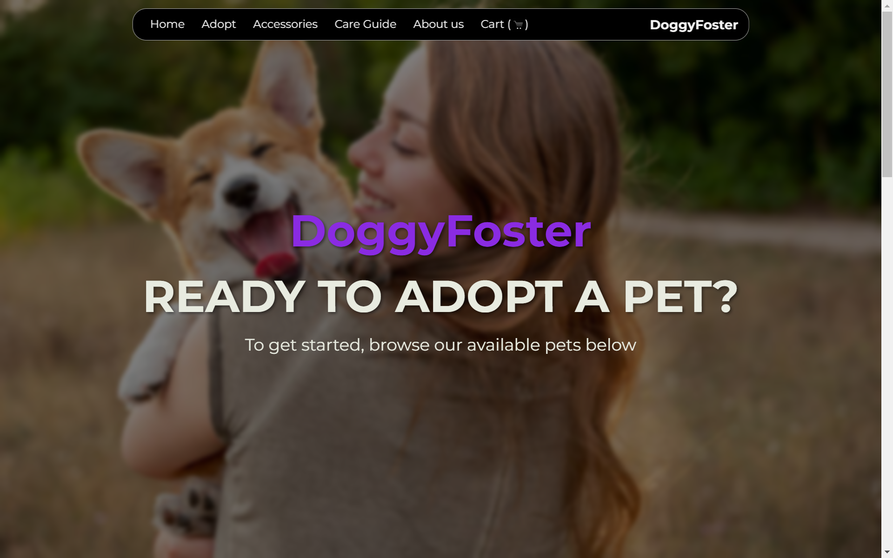
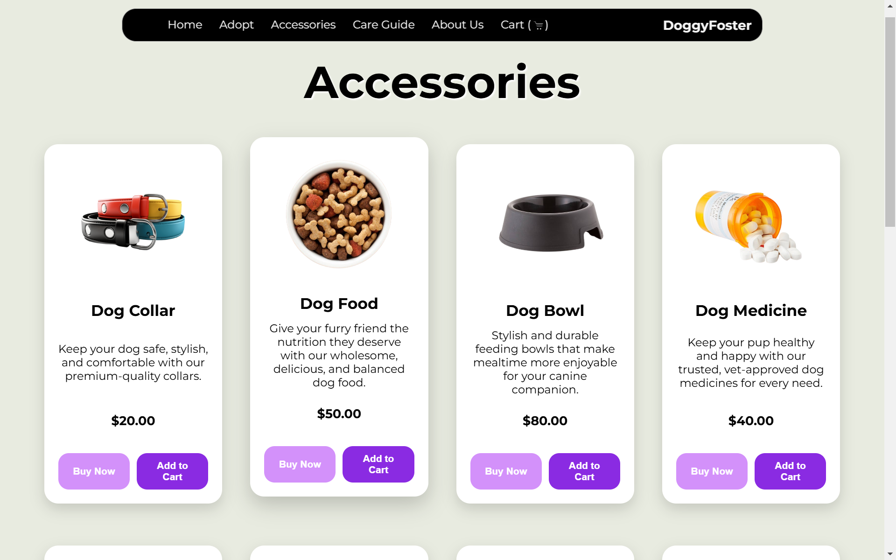
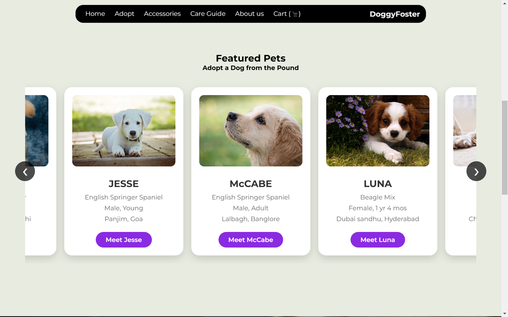
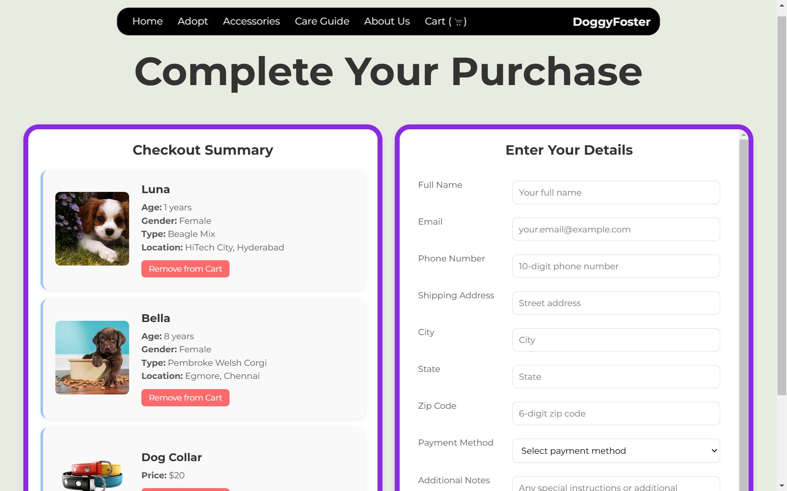

# Pet Adoption Website

A web application designed to connect potential pet parents with dogs available for adoption, making the pet adoption process more accessible and efficient.






## Overview

The Pet Adoption Website is a platform that helps users find dogs for adoption based on various search criteria. The website provides a user-friendly interface to browse available dogs, filter by traits, and submit adoption applications.

## Features

- **Search and Filter**: Find dogs based on breed, age, size, and other characteristics
- **Detailed Profiles**: View comprehensive information about each dog including photos, personality traits, and health information
- **Adoption Application**: Submit applications directly through the platform
- **User Accounts**: Create accounts to save favorite dogs and track application status
- **Mobile Responsive**: Fully functional across all device sizes

## Technologies Used

- **Frontend**: HTML, CSS, JavaScript, React.js
- **Backend**: Node.js, Express.js
- **Database**: MongoDB
- **Authentication**: JWT (JSON Web Tokens)
- **API**: RESTful API architecture
- **Deployment**: Docker, AWS/Heroku

## Installation

1. Clone the repository:
   ```
   git clone https://github.com/DoggyFoster/Pet_Adoption_Website.git
   ```

2. Navigate to the project directory:
   ```
   cd Pet_Adoption_Website
   ```

3. Install dependencies:
   ```
   npm install
   ```

4. Set up environment variables:
   - Create a `.env` file in the root directory
   - Add necessary environment variables (see `.env.example` for reference)

5. Start the development server:
   ```
   npm run dev
   ```

6. Open your browser and navigate to `http://localhost:3000`

## Project Structure

```
Pet_Adoption_Website/
├── client/               # Frontend React application
├── server/               # Backend Node.js application
├── public/               # Static files
├── docs/                 # Documentation
└── README.md             # Project overview
```

## Contributing

We welcome contributions to improve the Pet Adoption Website! Please follow these steps:

1. Fork the repository
2. Create a feature branch (`git checkout -b feature/amazing-feature`)
3. Commit your changes (`git commit -m 'Add some amazing feature'`)
4. Push to the branch (`git push origin feature/amazing-feature`)
5. Open a Pull Request

## License

This project is licensed under the MIT License - see the LICENSE file for details.

## Contact

Project Link: [https://github.com/DoggyFoster/Pet_Adoption_Website](https://github.com/DoggyFoster/Pet_Adoption_Website)

## Acknowledgments

- All the animal shelters that provided data
- The open source community for their invaluable tools and libraries
- Everyone who contributes to finding forever homes for dogs in need
